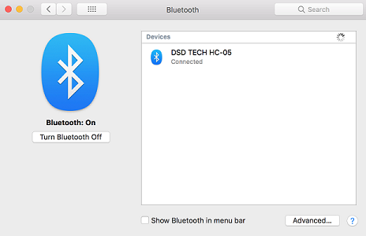

# BluetoothExtension
This extension provides Bluetooth support to NetLogo using the BlueCove library and provides a similar interface used by the Arduino extension

To add this extension, download the `bluetooth.zip` file found under releases and extract it, which will produce a bluetooth folder.   Put this folder (which contains 2 jar files) in the extensions folder of your NetLogo 6.x installation.

## Connecting to the computer
Before using the Bluetooth extension, the bluetooth device must be connected your computer or else your devices can't be found in NetLogo.
### Mac

1. Go to System Preferences and click on "Bluetooth"
2. Find your device on the list of Bluetooth devices and click connect
3. Enter the passkey if needed
### Windows

1. Open up Settings and click on "Bluetooth & other devices"
2. Add a discoverable Bluetooth device and click connect
3. Enter the passkey if needed and wait for Windows to say your device is ready to go

## Converting code from the Arduino extension for the Bluetooth extension 
The setup process for using the Bluetooth extension is fairly similar to the process of setting up the Arduino extension. If a project is already compatible with the Arduino extension, a find and replace of `arduino` to `bluetooth` will work for the most part.

An example is provided of the Arduino sample project converted for the Bluetooth extension. The same Arduino sketch from the Arduino sample should be used for the Bluetooth example.

### Notes
* `bluetooth:devices` is not a primitive, the equivalient of `arduino:ports` is `bluetooth:devices`
* One must call `bluetooth:devices` in order to call `bluetooth:open` 
* If you get a timeout for calling `bluetooth:open` on Mac, try reconnecting the Bluetooth device to your computer via System Preferences
* If you get an error saying the you can't access the a port with `bluetooth:open` on Windows, try reconnecting the Bluetooth device to your computer via Settings
